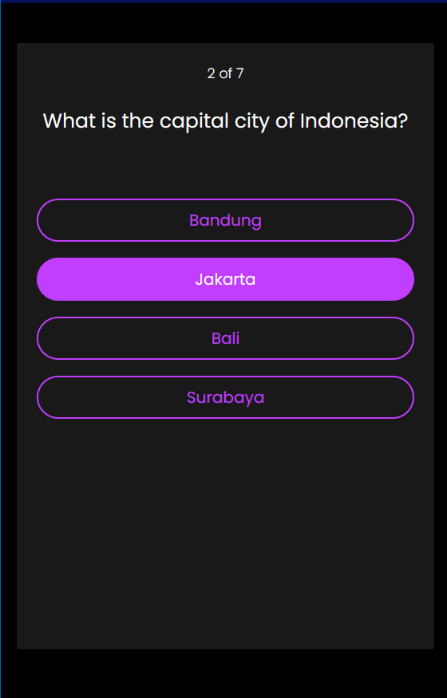
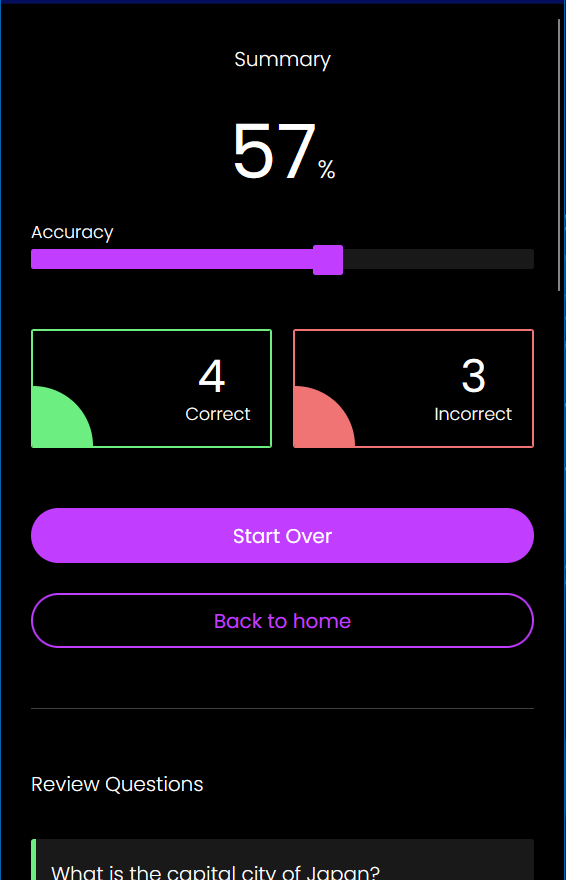
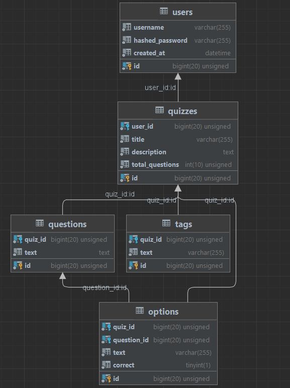

# QUIZZ

Online quiz application you can enjoy with your friends

## Functions

-   **Login** -> User authentication before accessing the application
-   **Signup** -> Registration page to create an account
-   **Home page** -> Display all quizzes from all users
-   **Play quiz** -> Users can play all the quiz available in the home page
-   **Create & edit quiz** -> Users are able to create and fully edit their quiz e.g., adding question, deleting question, etc.

---

\
Link to youtube
https://youtu.be/tqAUkAz7LgA

---

\
Images

Login page


Signup page


Home page


Quiz page


Quiz play page


Quiz result page



My quizzes page


Profile page


Quiz edit page


404 page


---

\


---

### How to run the application?

-   Front-end -> go to _./client_ and run `npm start`
-   Back-end -> go to _./server_ and run `npm run devStart`

\

### API Endpoints

**Post**

```
/signup

{
    username: "john_doe",
    password: "Password123"
}
```

```
/Login

{
    username: "john_doe",
    password: "Password123"
}
```

```
/addTag

{
    const quiz_id: 10,
    text: "Math"
}
```

```
/addQuestion

{
    quiz_id: 10
}
```

```
/addOption

{
    quiz_id: 10,
    question_id: 1,
    text: Option 1
}
```

```
/createQuiz

{
    user_id: 1,
    title: "This is title",
    description: "This is description",
    total_question: 1
}

```

**Get**

```
/quiz/:quiz_id

{
    quiz_id: 10,
}
```

```
/getQuizData/:quiz_id

{
    quiz_id: 10,
}

```

```
/:userId/quizzes

{
    user_id: 1,
}
```

```
/me

# no parameter (get data from cookies)
```

```
/

# no parameter (get all quizzes)
```

**Patch**

```
/updateQuestionText

{
    quiz_id: 10,
    question_id: 3,
    newText: "This is question updated text"
}
```

```
/updateOptionText

{
    quiz_id: 10,
    question_id: 3,
    newText: "This is option updated text"
}
```

```
/updateOptionBoolean

{
    updated_option_id: 1,
    old_option_id: 2
}
```

```
/updateTotalQuestions

{
    quiz_id: 10,
    total_questions: 20
}
```

**Delete**

```
/deleteQuestion

{
    quiz_id: 10,
    question_id: 2
}
```

```
/deleteOption

{
    question_id: 2,
    option_id: 8
}
```

```
/deleteTag

{
    tag_id: 4
}
```

```
/deleteQuiz

{
    quiz_id: 23
}
```
